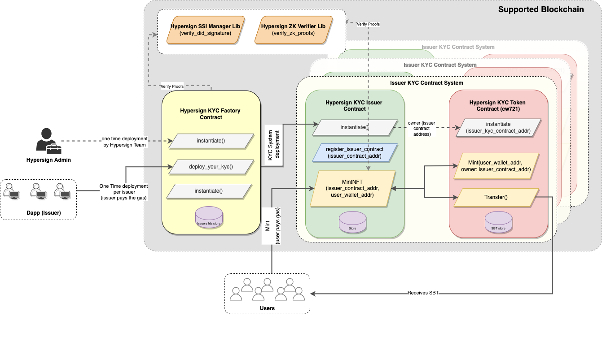

# Hypersign On-Chain KYC Contract Architecture

## Sequence diagram 

- Hypersign Admin deploys `Hypersign_KYC_factory_Contract`
- **Issuer Onboarding:**
    - Issuer invokes `deploy_your_kyc()` of `Hypersign_KYC_factory_Contract` to deploy its KYC System:
        - `Issuer_KYC_Contract` is instantiated.
        - `Issuer_NFT_Contract` (cw-721) is instantiated 
        - `Issuer_KYC_Contract` is set as admin of `Issuer_NFT_Contract`.
    - `Issuer_KYC_Contract`_address  gets registered as issuer in `Hypersign_KYC_factory_contract`
- **User on-chain KYC Process:**
    - User calls `mintNFT()` of the `Issuer_KYC_Contract` (user pays the gas - fee for the entire transaction)
        - which then will call `mint()` of `Issuer_NFT_Contract` (`Issuer_KYC_Contract` becomes the owner of NFT)
        - Which then will call `transfer()` of `Issuer_NFT_Contract` (transfering NFT from `Issuer_KYC_Contract` to user)

## TODOs

- [x] Research
    - [x] Figoure out spec for SBT (cw-721-non-transferable)
    - [x] Figure out how can you make a smart contract mint SBT
    - [x] Figure out how to instantiate one contract from the other in factory design pattern
- [x] Implement  basic `Hypersign_KYC_factory_Contract`
    - [x] Implement  `deploy_your_Kyc()` to onboard an issuer in the system 
- [x] Implement basic `Issuer_KYC_Contract`
    - [x] Implment `init()` to initialize the NFT contract
    - [x] Implement `mint()` to mint a NFT to the user
- [x] Integrate entity dashboard to `deploy_your_Kyc()` from the UI
- [x] Integrate widget UI to mint SBTs
- [x] Implement mint-sbt module in hypersig kyc service 
- [x] Implement feature in caach server to capture user's miniing step
- [x] Implement widget configuration page in Entity KYC dashboard
----------------------------------------------------------------
- [x] Figure out how can we verify issuer_did (over IBC / ORacle etc.)
- [x] Figure out how to canonize a json ld
- [x] Figure out how can we verify DID of issuer in the factory contract while onboarding/deboarding an issuer
----------------------------------------------------------------
- [x] Implement `SSI_manager_contract` with constructor params `{ did_method: "did:testnet:hid" }`
    - [x] Implement helper method - `verify_proof() -> true`
    - [x] Implement `register_did({did, signed_did_doc})`
    - [x] Implement `resolve_did({did}) -> did_doc`
    - [x] Implement helper method - `canonize_ld_doc({ld_doc, context}) -> string`
- [x] Improve `instantiation({SSI_manager_contract, hs_admin_did, hs_admin_did_doc, hs_admin_did_doc_proof})` of `Hypersign_KYC_factory_Contract` to whitelist `SSI_manager_contract` address and whitelist hypersign_did
- [ ] Improve `deploy_your_Kyc({issuer_did_proof, hs_authorization_presentation, issuer_did})` in `Hypersign_KYC_factory_Contract` 
    - [ ] to verify issuer_did before onboarding.
    - [ ] to verify presentation signed by hypersign_did (only allow those issuers who have authorization)
- [ ] Improve `mint({user_did, user_did_proof, issuer_authorization_presentation})` of `Issuer_KYC_Contract` 
    - [ ] to verify user_did
    - [ ] to verify signed presentation by issuer_did (only allow those users who have authorization)
- [ ] Implement request did-auth for issuer did in onchain-kyc page in dashboard during onchain kyc deployment step
- [ ] Implement request `hs_authorization_credential` in onchain-kyc page in dashboard during onchain kyc deployment step
- [ ] Implement generate `hs_authorization_presentation` in onchain-kyc page in dashboard during onchain kyc deployment step
- [ ] Implement request did-auth for user_did in mint NFT page in widget during performing KYC
- [ ] Implement request `issuer_authorization_credential` in mint NFT page in widget during performing KYC
- [ ] Update new contract address in widget and dashboard and test the entire flow.
----------------------------------------------------------------
- [ ] Onchain data models (what exact data will go in the metadata of NFT)
----------------------------------------------------------------
- [ ] Backward compatibility with the old version
- [ ] Verify if the user has actually done the minitng by calling the contract in the `verify()` of `SbtMintService` service
- [ ] Integrate facefi API backend
- [ ] The widget URL should be signed and then sent given to the user for security purposess
- [ ] Refator code; use wrappers
- [ ] Implement multitest cases 
- [ ] Work on all edge cases of smart contract
- [ ] Contract optimization; see how we can improve gas fee, 
- [ ] Check for any security loopholes

## Resources

- [Hypersign On-chain kyc documentation](https://docs.google.com/document/d/1Gso6w9mbkRlv6bvyQDnrhqZhmoD9WOhleY3p2LVIJOQ/edit#heading=h.1krz9xs6n001)
- [CosmWasm Documentation](https://docs.cosmwasm.com/docs/smart-contracts/state/cw-plus)
https://docs.aura.network/developer/tutorials/non-fungible-tokens/instantiate
https://book.cosmwasm.com/

https://docs.burnt.com/xion/develop/cosmwasm-resources/contract-semantics/message/submessages#transmitting-context-between-contracts

https://book.cosmwasm.com/cross-contract/map-storage.html

