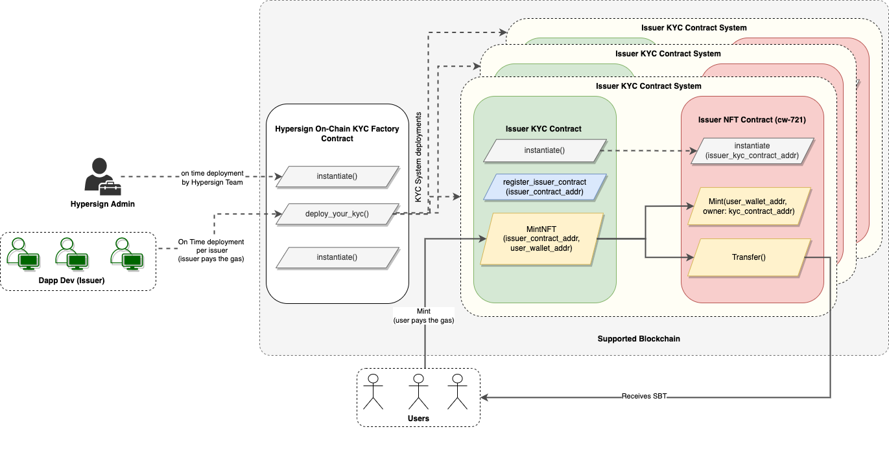

# Hypersign On-Chain KYC Contract Architecture

- Hypersign Admin deploys `Hypersign_KYC_factory_Contract`
- **Issuer Onboarding:**
    - Issuer invokes `deploy_your_kyc()` of `Hypersign_KYC_factory_Contract` to deploy its KYC System:
        - `Issuer_KYC_Contract` is instantiated.
        - `Issuer_NFT_Contract` (cw-721) is instantiated 
        - `Issuer_KYC_Contract` is set as admin of `Issuer_NFT_Contract`.
    - `Issuer_KYC_Contract`_address  gets registered as issuer in `Hypersign_KYC_factory_contract`
- **User on-chain KYC Process:**
    - User calls `mintNFT()` of the `Issuer_KYC_Contract` (user pays the gas - fee for the entire transaction)
        - which then will call `mint()` of `Issuer_NFT_Contract` (`Issuer_KYC_Contract` becomes the owner of NFT)
        - Which then will call `transfer()` of `Issuer_NFT_Contract` (transfering NFT from `Issuer_KYC_Contract` to user)
